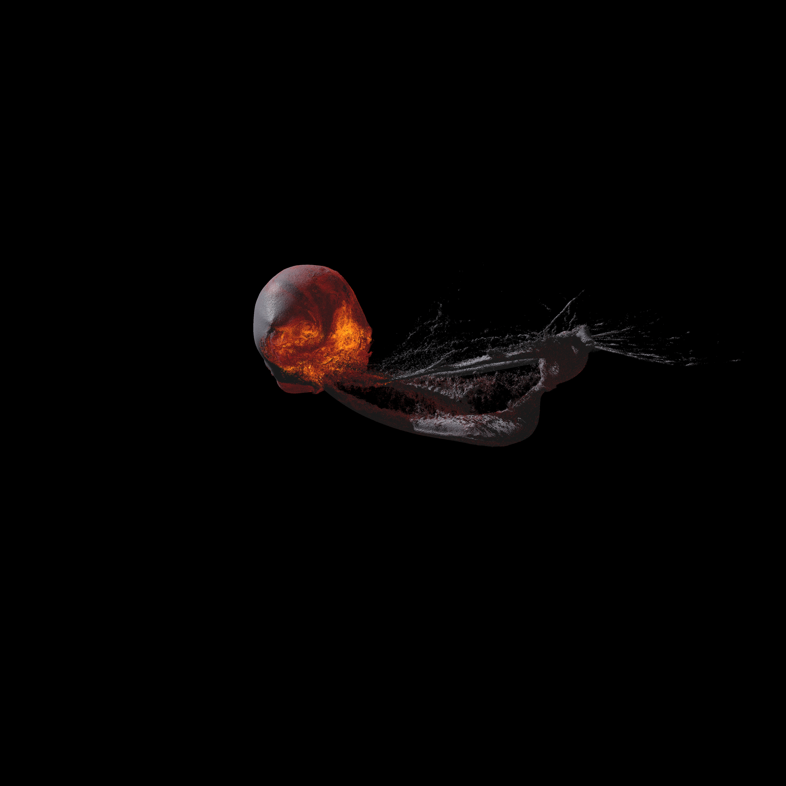

# Smoothed Particle Hydrodynamics simulation applied to the canonical moon forming impact in Metal C++



Full compute to render real time smoothed particle hydrodynamics solver including:
  - Self gravity using the fast multipole method
  - Variable smoothing length
  - The ANEOS equations of state
  - Artificial viscosity with a Cullen and Dehnen switch
  - Variable time stepping

## Setup and Usage
1. Install hdf5 with homebrew:
   ```
   brew install hdf5
   ```
3. Clone the repository:
   ```bash
   git clone https://github.com/Charlie-Close/Real-Time-Planetary-Impacts-MPS.git
   ```
4. Open the project in Xcode:
   ```bash
   cd Real-Time-Planetary-Impacts-MPS
   open SPH.xcodeproj
   ```
5. Build and run the project:
  - Click the Run button in Xcode, and the simulation will start.
  - Simulation parameters can be tuned in Parameters.h.
  - Move the camera with WASDQE and click and drag to look around

## Implementation and Methodology

### Nearest Neighbours


During the density and acceleration loop in SPH, particle need to interact with their nearest neighbours. In order to do this, I have opted for a hash and sort approach, as with efficient sorting algorithms this has a time complexity of N. The high level idea is that by splitting space up into cubic cells, if each particle knows what cell it is in, it can just check the surrounding cells for neighbours, rather than looping through every particle.

The "hash" part is fairly simple - each particle calculates a cell coordinate from a cell width and the number of cells in each dimension. A Morton encoding function is then used to turn this 3D coordinate into an index, while keeping nearby cells close to each other in the array for better memory access.

The "sort" part is a little more involved, as sorting algorithms on the GPU are non trivial. I have implemented a radix sort - a sorting algorithm with a time complexity of N (effectively). This takes an array of uint2s, cell index and particle index, and sorts it by cell index.

Then an array of cell starts and cell ends is produced. Each cell finds where in the array it starts and ends. This means to find all the particles in a given cell index, we look in the cell starts and ends array at that index, and then loop in this region in our sorted array.

As the cells repeat (as their cell index is found via modular division), two particles can be in the same cell, but very far apart. Therefore a 'large cell index' is also asigned to each particle so they can be skipped during neighbourhood loops.

### Fast Multipole Method

To simulate gravity, we need an octree. I have opted to build it on the CPU - the key is, it that the optimal octree is not needed for accuracy, it just aids performance. When performing our multipole acceptance criterion, as long as all the properties of a node are accurate, our math is valid. A suboptimal octree will result in larger leaves and branches, and therefore will require us to traverse deeper into the tree. Therefore the octree structure is calculated on the CPU in a separarte thread, and updated whenever possible. This results in the octree construction never blocking the compute.

During the up pass, we go layer by layer and calculate the multipole expansion for each node. Leaves just do this from their particles, branches do this via a M2M transformation and sum their children.

The down pass is typically the bottle neck of the simulation. Each node looks at the other nodes in it's layer. It decides which nodes it can treat as a multipole and produce a local expansion, and which need to be broken down further. It then stores an array of unchecked nodes (the nodes which need to be broken down further) which it's children can then use, and passes it's local expansion to it's children. It's children can then, rather than check every other node in it's layer, can just check the nodes which it's parent couldn't check to build on top of it's parents local expansion, and repeat the process. This goes all the way down the tree till the particles can use the local expansion to calculate their acceleration.

### Hydrodynamics

A fairly standard implementation of SPH.

The density pass first uses the newton raphson method to calculate it's smoothing length, and then calculates it's density, pressure, sound speed, gradient terms and the balsara switch, and a value for alpha loc.

The acceleration pass then does a single neighbourhood loop to calculate the acceleration, internal energy time derivative, smoothing length time derivative, and a smoothed value of alpha loc to evolve the viscosity alpha. We then take run a second acceleration pass one half time step ahead (which is variable for each individual particle) and calculate the acceleration, internal energy time derivative and smoothing length time derivative at this half time step.

In order to implement the ANEOS equations of state, a 2D texture is produced on the CPU at initialisation. The uv coordinates found from the density and internal energy of a particle yield the pressure and smoothing length. This avoids a binary search at runtime, and results in very fast bilinear interpolation.

### Time stepping

Timesteps for each particle are calculated using the CFL condition. Particles can then calcualte their next active time (i.e. the global time when they will be active again). The global time is stepped by the smallest timestep. Inactive particles are particles with a next active time greater than the global time. Their properties are just integrated, rather than runnning neighbourhood loops. Particles timesteps are rounded down to the nearest power of 2 multiple of DT_MIN (set in the paramaters.h file).

### Rendering

Particles are rendered as circles. Two shading methods are used - the circles can either be shaded to look like spheres or we can shade them according to the local density gradient. This second method gives the objects a much smoother, and less grainy appearance, so is the preffered method when rendering clusters of particles. However when the particles detach from a cluster, the local density gradient becomes less meaningful, and potentially immesurable if there are no other particles withing the maximum smoothing length, and therefore we render these as spheres. To stop flickering between these shading methods, we smooth between them according to the gradient. The colour of particles are determined buy their temperature (which can be found via the ANEOS EOS). Particles have a default grey colour, but as they get hotter they start emmitting via black body radiation. Note this radiation does not currently have any effect on the internal energy of the particles (maybe a problem to tackle in the future?).
